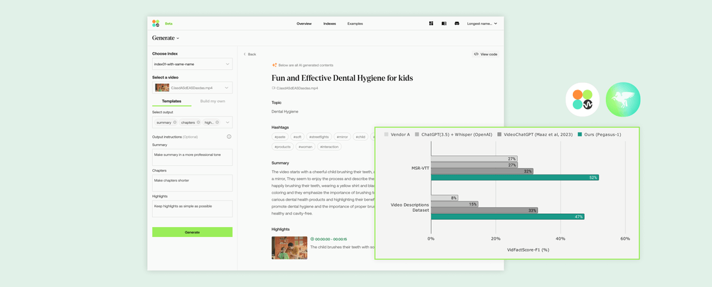
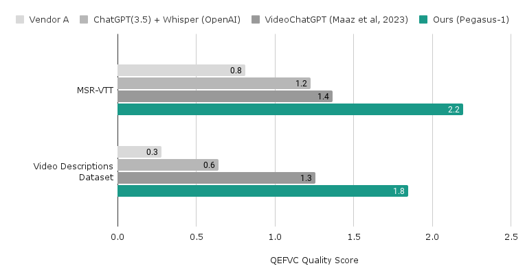
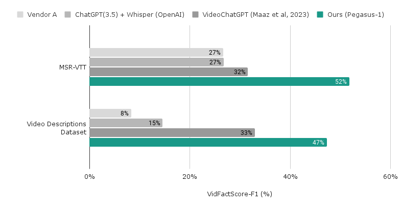

# Pegasus-1 Evaluation
## Pegasus-1 - The new state-of-the-art video-language foundation model for generating text from a video
Pegasus-1 is a state-of-the-art video-to-text generation model designed by TwelveLabs. Pegasus-1 incorporates visual and speech information to generate comprehensive text from video, achieving the new state-of-the-art performance by huge margins on several video summarization tasks.



This repository provides the evaluation code for the outputs generated by Pegasus-1 and baseline models for the video summarization task.
- What datasets are used?
    1. [MSR-VTT Dataset](https://www.microsoft.com/en-us/research/wp-content/uploads/2016/06/cvpr16.msr-vtt.tmei_-1.pdf) (Xu et al., 2016) 
    2. [Video-ChatGPT Video Descriptions Dataset](https://arxiv.org/pdf/2306.05424.pdf) (Maaz et al., 2023)
- What metrics are used?
	1. Following the [Quantitative Evaluation Framework for Video-based Conversation Models](https://mbzuai-oryx.github.io/Video-ChatGPT/) (QEFVC)(Maaz et al., 2023), we measure Correctness of Information, Detail Orientation, and Contextual Understanding by asking an instruction-tuned language model (e.g., GPT-4) about each criterion with respect to the reference summary.
	2. Inspired by [FActScore](https://arxiv.org/pdf/2305.14251.pdf) (Min et al., 2023), **we develop a new evaluation scheme, VidFactScore(Video Factual Score),** to measure the quality of the summary in a fine-grained manner.
- What models are used as baselines?
	1. **[Video-ChatGPT](https://arxiv.org/pdf/2306.05424.pdf) (Maaz et al., 2023)**
	2. **Whisper + ChatGPT-3.5 (OpenAI)**
	3. **Vendor A’s Summary API**

Details about Pegasus-1 and the evaluation datasets and metrics can be found in [TwelveLabs blog post](https://app.twelvelabs.io/blog/introducing-pegasus-1).

## Installation
```bash
conda create -n pegasus-eval python=3.10
conda activate pegasus-eval

git clone https://github.com/twelvelabs-io/pegasus-1-eval.git
cd pegasus-1-eval
pip install -r requirements.txt
```
## Data Preparation
### MSR-VTT GT JSON Preparation
#### Download annotation files
We have already prepared the necessary annotation files for MSR-VTT in the location `data/msrvtt/`.
- `test_videodatainfo.json`: A file containing all 20 annotations for each test sample. The file is from the original MSR-VTT dataset, the link to which has now expired.
- `MSRVTT_JSFUSION_test.csv`: A file containing JSFusion split of the dataset. You can download the file that [CLIP4Clip](https://github.com/ArrowLuo/CLIP4Clip/) has prepared [here](https://github.com/ArrowLuo/CLIP4Clip/releases/download/v0.0/msrvtt_data.zip).
#### Run processing script
Since MSR-VTT has 20 annotations per video, we use chatGPT to generate a single annotation that represents the union of information from each annotation, which we use as the ground truth summary.
```bash
python scripts/get_gt_msrvtt.py \
  --input_path "data/msrvtt/test_videodatainfo.json" \
  --split_path "data/msrvtt/MSRVTT_JSFUSION_test.csv" \
  --out_path "data/msrvtt_jsfusion_gt.json" \
  --api_key "${YOUR_OPENAI_KEY}"
```
### Video-ChatGPT GT JSON Preparation
#### Download annotation files
Download human-generated detailed descriptions collected by [Video-ChatGPT](https://github.com/mbzuai-oryx/Video-ChatGPT), from [here](https://mbzuaiac-my.sharepoint.com/:u:/g/personal/hanoona_bangalath_mbzuai_ac_ae/EYqblLdszspJkayPvVIm5s0BCvl0m6q6B-ipmrNg-pqn6A?e=QFzc1U). \
If the link is invalid, please contact the original authors of Video-ChatGPT for assistance with downloading the annotations.

Unzip the downloaded file to a directory `data/vgpt/`.
```bash
unzip ${DOWNLOADED_ZIP_PATH} -d data/vgpt/
```

If the annotation has downloaded successfully, you should have several `.txt` files under `data/vgpt/Test_Human_Annotated_Captions/`.

#### Run processing script
```bash
python scripts/get_gt_vgpt.py \
  --input_path "data/vgpt/Test_Human_Annotated_Captions" \
  --out_path "data/vgpt_gt.json"
```

## Computing Evaluation Metrics
### QEFVC Evaluation
#### Preprocessing data for QEFVC evaluation
First, you should preprocess data for QEFVC evaluation by running the following scripts.
```bash
# Preprocessing MSR-VTT examples
bash scripts/preprocess_qefvc_msrvtt.sh

# Preprocessing Video-ChatGPT examples
bash scripts/preprocess_qefvc_vgpt.sh
```
#### Run QEFVC evaluation
Run the following script to run QEFVC evaluation. Replace `${YOUR_OPENAI_KEY}` with your own OpenAI API key.
```bash
OPENAI_API_KEY="${YOUR_OPENAI_KEY}" bash scripts/evaluate_benchmark.sh
```

### VidFactScore Evaluation
#### Atomizing
First, you should atomize predicted summaries into atomic facts by running the following script.
```
bash scripts/vfs_atomize.sh
```
#### Computing precision and recall
Run the following script to run VidFactScore evaluation and compute precision and recall scores.
```
bash scripts/vfs_precision_recall_compute.sh
```
#### Counting precision and recall
```
python eval_vfs/count_pr.py 
```

## Results
### QEFVC Evaluation Results

1. MSR-VTT dataset results

| Model | Detail Orientation | Contextual Understanding | Correctness of Information |
| :---: | ----------------: | ----------------------: | ------------------------: |
| Vendor A | 0.795 | 0.905 | 0.733 |
| Whisper + ChatGPT-3.5 | 1.255 | 1.306 | 1.123 |
| Video-ChatGPT | 1.515 | 1.398 | 1.186 |
| Pegasus-1 | **2.253** | **2.324** | **2.011** |

2. Video-ChatGPT dataset results

| Model | Detail Orientation | Contextual Understanding | Correctness of Information |
| :---: | ----------------: | ----------------------: | ------------------------: |
| Vendor A | 0.347 | 0.311 | 0.214 |
| Whisper + ChatGPT-3.5 | 0.790 | 0.687 | 0.491 |
| Video-ChatGPT | 1.325 | 1.419 | 1.190 |
| Pegasus-1 | **1.996** | **2.146** | **1.693** |

### VidFactScore Results

1. MSR-VTT dataset results

| Model | Precision | Recall | F1 |
| :---: | ----------------: | ----------------------: | ------------------------: |
| Vendor A | 29.3% | 24.4% | 27.2% |
| Whisper + ChatGPT-3.5 | 28.2% | 25.4% | 26.7% |
| Video-ChatGPT | 37.6% | 27.2% | 31.6% |
| Pegasus-1 | **57.7%** | **46.9%** | **51.7%** |

2. Video-ChatGPT dataset results

| Model | Precision | Recall | F1 |
| :---: | ----------------: | ----------------------: | ------------------------: |
| Vendor A | 12.8% | 6.2% | 8.4% |
| Whisper + ChatGPT-3.5 | 13.1% | 16.4% | 14.6% |
| Video-ChatGPT | 43.6% | 26.5% | 33.0% |
| Pegasus-1 | **58.1** | **40.0%** | **47.4%** |

## Qualitative Analysis (Summary)
Click the thumbnails to watch the videos in YouTube. \
If you want to check more detailed results beyond the Summary, such as Title, Topic, Chapters, QA, please refer to [TwelveLabs blog post](https://app.twelvelabs.io/blog/introducing-pegasus-1).

### Ex 1: Ad Video (Visual-based)
[](https://www.youtube.com/watch?v=VtvjbmoDx-I)
> The video takes us into the underground world, where a group of individuals move through dark tunnels, armed with guns, as they celebrate the first anniversary of the Information Purification Convictives. They have created a pure ideology, something unprecedented in history. The energy and excitement of a live event come alive as we see people engaged in various activities. A woman dressed in white leads the way, followed by others who join in, their enthusiasm palpable. A captivating display on a large screen captures the attention of the crowd, adding to the overall excitement. Amidst this chaos, we witness a skilled martial artist, the same woman in white, navigating a dangerous hallway while being pursued by armed men, showcasing her incredible combat skills. The scene is dramatically lit, creating a sense of tension and anticipation. The video concludes with the introduction of Apple's groundbreaking product, the Macintosh, promising a future that breaks away from the conformity of 1984. It is a mesmerizing journey into the underground revolution, a mix of ideology, thrilling action, and a glimpse of the future.

### Ex 2: Reaction Video (ASR)
[](https://www.youtube.com/watch?v=DEgt25yYidY)
> In this video, we see a chaotic and hectic restaurant kitchen environment. The man in black attire watches various videos and reacts to the content, which includes interviews with staff members discussing their experiences in restaurant management. There are discussions about menu creativity, the importance of proper management, and the challenges faced in the kitchen. The video captures the frustrations of the staff, communication breakdowns, and the need for improvement in food quality. Despite the chaos, there are moments of success and teamwork. The video also highlights the presence of influential food bloggers and the impact of their reviews. Overall, the video showcases the challenges and triumphs of running a restaurant, with a mix of humor, frustration, and determination. 

## Acknowledgments
1. [Video-ChatGPT](https://github.com/mbzuai-oryx/Video-ChatGPT): QEFVC evaluation codes were built based on the evaluation codes of Video-ChatGPT. We conducted the evaluation using human-annotated descriptions of videos collected by Video-ChatGPT.
2. [MSR-VTT](https://www.microsoft.com/en-us/research/publication/msr-vtt-a-large-video-description-dataset-for-bridging-video-and-language/): We conducted evaluations using MSR-VTT video captioning dataset.

## License
This project is licensed under **CC BY-NC-SA 4.0** license. See [LICENSE](LICENSE) for more details.
